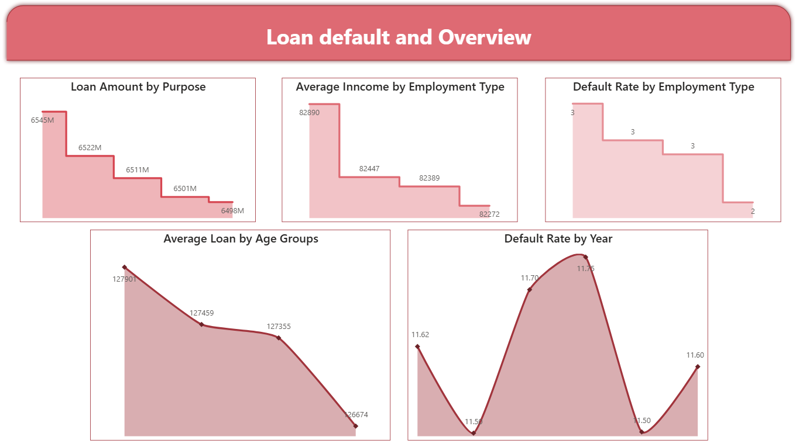
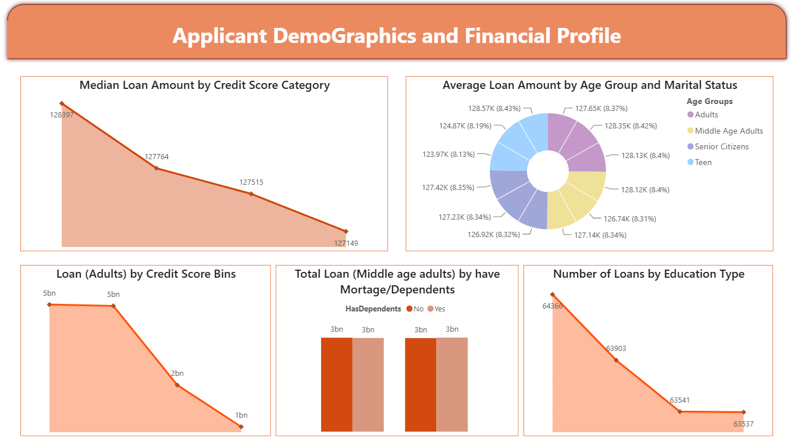

##Financial Loan Analytics Dashboard

## 📌 Overview
LoanScope is an end-to-end Power BI project designed to analyze loan data, applicant demographics, and default risk patterns.  
The project integrates **SQL Server, Power BI Dataflows, Gateway configuration, and DAX-based analytics** to build a scalable and interactive reporting solution.

---

## 🎯 Objectives
- Analyze loan distribution across purpose, age groups, and education  
- Identify patterns in loan defaults across employment types and time  
- Evaluate financial behavior using income and demographic segmentation  
- Build reusable data pipelines using Power BI Dataflows  
- Apply DAX for advanced calculations (YoY, YTD, Median, Default Rate)  

---

## 🏗️ Project Architecture
- **Data Integration:** Power BI Dataflow (Gen1)  
- **Gateway:** On-Premises Data Gateway (Standard Mode)
- **Data cleaning:** Power Query editor
- **Visualization:** Power BI Desktop  
- **Publishing:** Power BI Service  

---

## 🔄 Data Pipeline Workflow
1. Installed and configured **On-Premises Data Gateway**  
2. Imported loan dataset into **SQL Server database**  
3. Created **Dataflow (Gen1)** in Power BI Service  
4. Connected SQL Server to Dataflow via gateway  
5. Loaded data into Power BI Desktop from Dataflow  
6. Performed data profiling and transformation using Power Query  

---

## 📊 Dashboard Features

### 🔹 Loan Default & Overview
- Loan Amount by Purpose  
- Average Income by Employment Type  
- Default Rate by Employment Type  
- Default Rate by Year  

### 🔹 Applicant Demographics & Financial Profile
- Median Loan Amount by Credit Score Category  
- Average Loan by Age Groups  
- Loan Distribution by Credit Score Bins  
- Loan by Education Type  
- Loan (Middle Age Adults) by Mortgage & Dependents  

### 🔹 Advanced Analytics
- YoY Loan Amount Change  
- YoY Default Loan Change  
- YTD Loan Amount by Credit Score & Marital Status  
- Decomposition Tree (Income Bracket vs Loan Amount)  

---

## 📈 Key Insights
- Loan amounts vary significantly across **credit score categories**  
- Default rates differ by **employment type and year trends**  
- Middle-aged adults contribute significantly to total loan volume  
- Income segmentation reveals strong correlation with loan distribution  
- Seasonal trends observed in loan and default patterns  

---

## 🧠 DAX Calculations Used
- Year Extraction  
- Loan Amount Aggregations  
- Average Income by Category  
- Default Rate Calculations  
- Median Loan Calculation  
- Age Group Segmentation  
- Credit Score Binning  
- YoY & YTD Metrics  
- SWITCH-based Income Bracket Classification  

---

## 🛠️ Tools & Technologies
- Power BI Desktop  
- Power BI Service (Dataflows)  
- SQL Server  
- Power Query Editor  
- DAX (Data Analysis Expressions)  
- On-Premises Data Gateway  

---

## 📂 Dataset
- Source: SQL Server (imported from Excel)  
- Contains:
  - Loan details  
  - Customer demographics  
  - Employment information  
  - Credit score and default status  

---

## 📸 Dashboard Preview

### 📊 Dashboard 1

### 📊 Dashboard 2

---

## 🚀 How to Use

1. Download the `.pbix` file from this repository
2. Open it using Microsoft Power BI Desktop
3. If prompted, update the data source path
4. Refresh the data to view the latest insights

---

## 💡 Key Learnings
- End-to-end data pipeline using Dataflows  
- Gateway setup and cloud integration  
- Writing complex DAX measures  
- Designing multi-page analytical dashboards  
- Combining SQL + Power BI for real-world analytics  

---

## 📬 Contact
Feel free to connect for feedback or collaboration!
